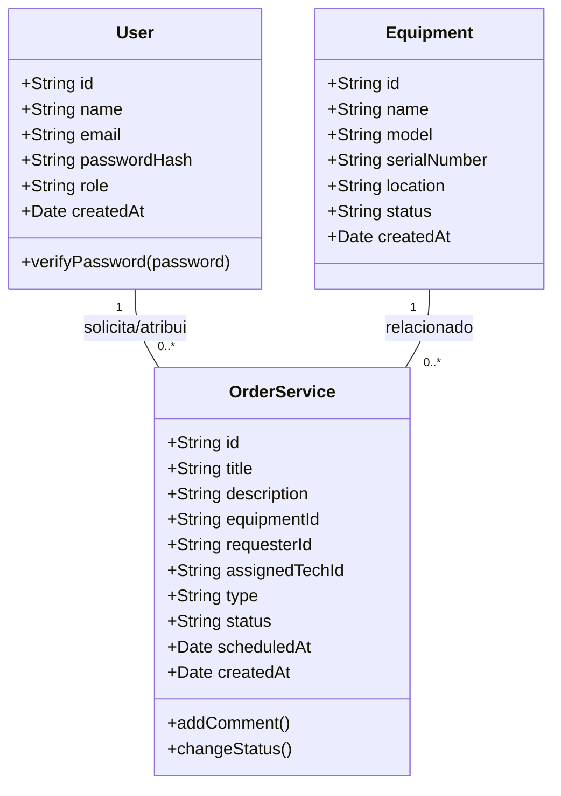
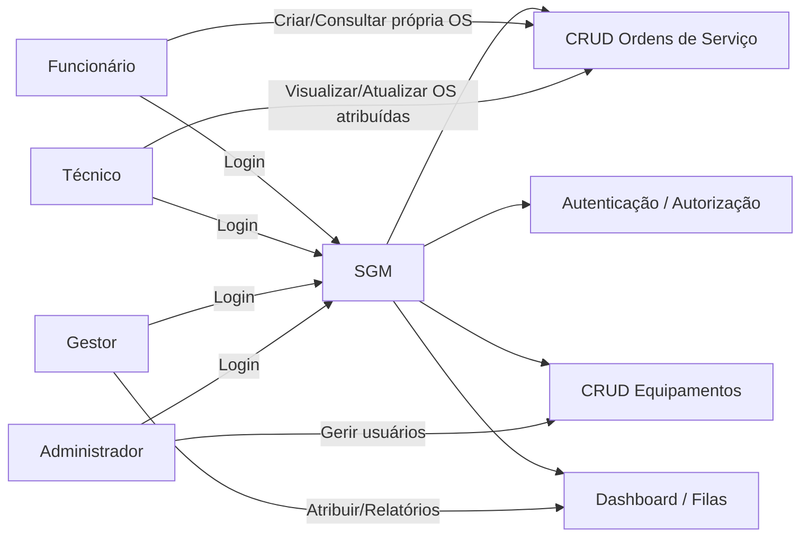
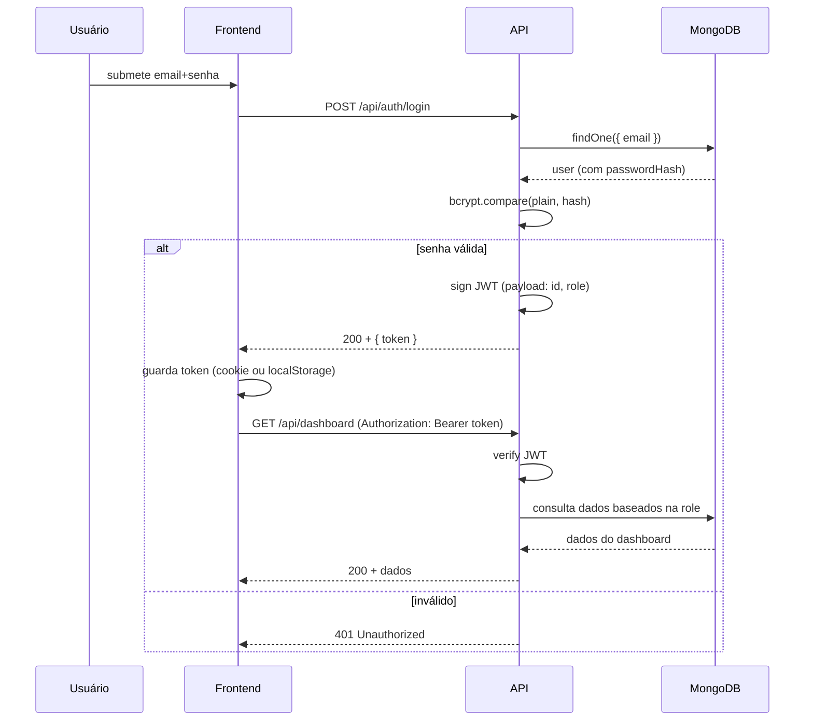

// ...existing code...
# SGM - Help Desk (InovaTech) - MVP

Descrição  
Aplicação MVP de um Sistema de Gestão de Manutenção (SGM) / Help Desk para controle de equipamentos e ordens de serviço. Implementação em arquitetura MVC com Next.js (App Router), MongoDB (Mongoose), JWT e bcrypt.

- Centralizar informações sobre equipamentos e manutenções.
- Agendar e gerenciar ordens de serviço (preventiva / corretiva).
- Perfis: employee (funcionário), tech (técnico), manager/admin.
- Controle de acesso via JWT; senhas com bcrypt.

Principais funcionalidades (MVP)
- Autenticação JWT com hashing de senha (bcrypt).
- CRUD de Equipamentos: nome, modelo, número de série, localização, status.
- CRUD de Ordens de Serviço (OS): título, descrição, equipamento, técnico responsável, tipo (preventiva/corretiva), status (aberta, em andamento, concluída), agendamento.
- Dashboard técnico com fila e filtros.
- Usuário funcionário vê apenas suas OS.
- Seed para criar usuários demo e exemplos de OS.

Estrutura do projeto (resumida)
- /src - frontend React (App router, componentes, estilos).
- /models - Mongoose models (User, Equipment, OrderService).
- /controllers - regras de negócio (auth, equipamentos, os).
- /app/api - handlers API (autenticação, equipamentos, os).
- /lib - conexão com MongoDB e utilitários (jwt, auth middleware).
- /scripts/seed.js - cria usuários demo e dados de exemplo.
  
Figma (protótipo)
-https://www.figma.com/design/UliZXkWac8XvEHTQs5TxIQ/Untitled?node-id=0-1&t=mhs2ikkpmLueyueW-1

Diagramação (Mermaid)

1) Diagrama de Classes

2) Diagrama de Casos de Uso

3) Diagrama de Fluxo (Login e Acesso ao Dashboard)

Análise de riscos 
- Exposição de credenciais/secretos -> usar .env e rotacionar secrets.
- Validação insuficiente de entrada -> sanitizar e validar no servidor.
- Controle de acesso -> checar roles em cada endpoint.
- Backup e integridade do DB -> rotinas de backup em produção.

Próximos passos 
- Implementar testes automatizados.
- Melhorar controles de permissão.
- Implementar paginação e notificações em tempo real.
- Revisão de UX com base no Figma.

Referências
- Next.js App Router, Mongoose, jsonwebtoken, bcrypt
